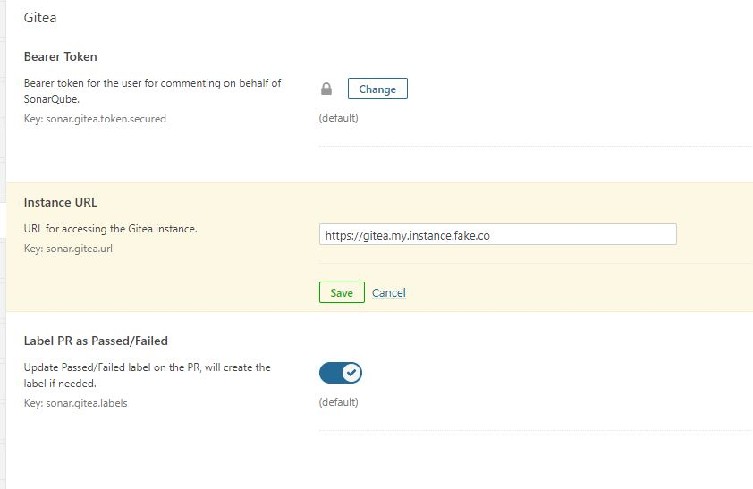
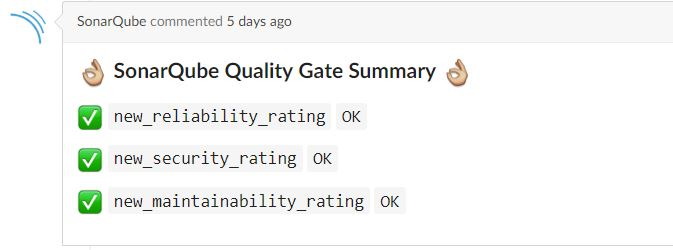
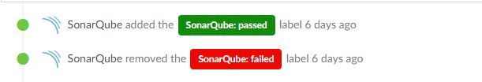

# Gitea SonarQube Plugin</br>[![quality-gate-status]][3] [![maintainability-rating]][3] [![reliability-rating]][3] [![security-rating]][3]</br>[![shields-io-maintenance]][0] [![travis-build-status]][1] [![coveralls-coverage-status]][2]
[](https://app.fossa.io/projects/git%2Bgithub.com%2FTomerFi%2Fsonar-gitea-plugin?ref=badge_shield)

This project is WIP (work in progress), a pre-release.</br>
The idea is a `SonarQube` plugin that decorates `Gitea`'s pull reqeusts
with Quality Gate result metrics,</br>as well as labeling it as *passed* or *failed*.

## Installing

```shell
 # linux
./mvnw package
 # windows
./mvnw.cmd package
```

This will create the `jar` file under the `maven`'s  `target` folder.</br>
Place the created `jar` file in your `SonarQube` plugins folder and restart.

## Configuring

After restarting, the plugin configuration will be added to administration control panel:</br>



> TIP:</br>
> You can create a designated user in your `Gitea` instance and call it `SonarQube`.</br>
> Generate the token with that user and give it a very strict password (to prevent abuse).</br>
> That will make the comments and labels to be pushed by the `SonarQube` user and not your own.

## How does it work

If configured, the plugin will check if the project's repository is a `Gitea` repository.</br>
If so, it will push the `QualityGate` result metrics to the pull request conversation as so:</br>



With further configuration, the plugin will also label the pull request as so:</br>



## Contributing

As stated earlyer, this is a work in progress.</br>
As such, there is tons of work and any contribution will be gladly accepted.</br>
Please check the [CONTRIBUTING.md](CONTRIBUTING.md) before contributing.

## Code of Conduct

Please check the [CODE_OF_CONDUCT.md](CODE_OF_CONDUCT.md) before opening an issue,
a pull request or contributing.

## License

[MIT License](LICENSE).

<!-- Real Links -->
[0]: https://github.com/TomerFi/sonar-gitea-plugin
[1]: https://travis-ci.org/TomerFi/sonar-gitea-plugin
[2]: https://coveralls.io/github/TomerFi/sonar-gitea-plugin
[3]: https://sonarcloud.io/dashboard?id=info.tomfi%3Asonar-gitea-plugin

<!-- Badges Links -->
[coveralls-coverage-status]: https://coveralls.io/repos/github/TomerFi/sonar-gitea-plugin/badge.svg
[maintainability-rating]: https://sonarcloud.io/api/project_badges/measure?project=info.tomfi%3Asonar-gitea-plugin&metric=sqale_rating
[reliability-rating]: https://sonarcloud.io/api/project_badges/measure?project=info.tomfi%3Asonar-gitea-plugin&metric=reliability_rating
[security-rating]: https://sonarcloud.io/api/project_badges/measure?project=info.tomfi%3Asonar-gitea-plugin&metric=security_rating
[shields-io-maintenance]: https://img.shields.io/badge/Maintained%3F-yes-green.svg
[technical-debt]: https://sonarcloud.io/api/project_badges/measure?project=info.tomfi%3Asonar-gitea-plugin&metric=sqale_index
[travis-build-status]: https://travis-ci.org/TomerFi/sonar-gitea-plugin.svg?branch=dev
[quality-gate-status]: https://sonarcloud.io/api/project_badges/measure?project=info.tomfi%3Asonar-gitea-plugin&metric=alert_status


[](https://app.fossa.io/projects/git%2Bgithub.com%2FTomerFi%2Fsonar-gitea-plugin?ref=badge_large)